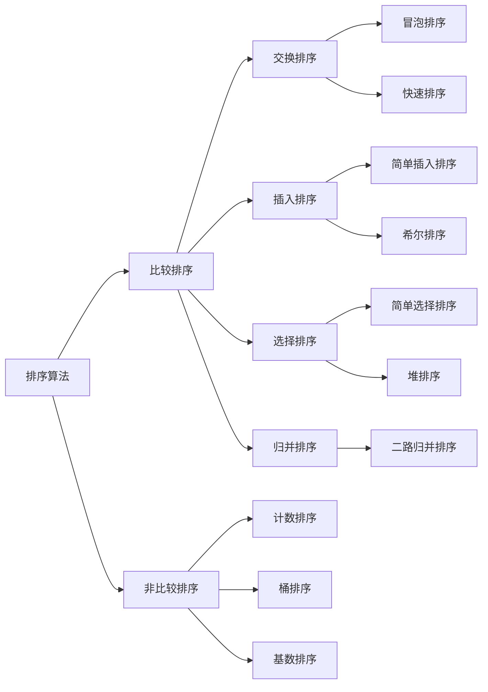

# 位运算

## 位运算符

| 含义                       | 运算符 | 示例                |
| -------------------------- | ------ | ------------------- |
| 左移                       | <<     | 0011 << = 0110      |
| 右移                       | >>     | 0011 >> =  0001     |
| 按位或                     | \|     | 0011 \| 1011 = 1011 |
| 按位与                     | &      | 0011 & 1011 = 0011  |
| 按位取反                   | ~      | ~0011 = 1100        |
| 按位异或（相同为0不同为1） | ^      | 0011 ^ 1011 = 1000  |

### XOR按位异或的一些运用
异或：相同为0，不同为1，也可以用”不进位加法“来理解

异或操作的一些特点：
    
    x^0=x;
    x^1s=~x // 1s表示全1
    x^(~x)=1s
    x^x=0
    c=a^b => b=a^c,a=b^c //交换两个数
    a^b^c=a^(b^c)=(a^b)^c //assciative
### 指定位置的位运算
- 将x的最右边的n位清零：x&(~0<<n)
- 获取x的第n位的值（0或者1）：x>>n&1
- 获取x的第n位幂值：x&(1<<n)
- 仅仅将第n位置为1：x|(1<<n)
- 仅仅将第n位置为0：x&(~(1<<n))
- 将x的最高位和第n位（包含n）清零：x&((1<<n)-1)

### 实战的位运算要点
- 判断奇偶
  - x % 2 == 1 --> x & 1 == 1
  - x % 2 == 0 --> x & 1 == 0
- x / 2 -> x >> 1
  - mid = (right + left) / 2 -> (right + left) >> 1
- x=x&(x-1)清零最低位的1
- x&-x 得到最低位的1
- x&~x=0

## 位运算例题

### 位1的个数
编写一个函数，输入是一个无符号整数，返回其二进制表达式中数字位数为 ‘1’ 的个数（也被称为汉明重量）。

示例 1：

    输入：00000000000000000000000000001011
    输出：3
    解释：输入的二进制串 00000000000000000000000000001011中，共有三位为 '1'。

示例 2：

    输入：00000000000000000000000010000000
    输出：1
    解释：输入的二进制串 00000000000000000000000010000000中，共有一位为 '1'。

示例 3：

    输入：11111111111111111111111111111101
    输出：31
    解释：输入的二进制串 11111111111111111111111111111101 中，共有 31 位为 '1'。


提示：

- 请注意，在某些语言（如 Java）中，没有无符号整数类型。在这种情况下，输入和输出都将被指定为有符号整数类型，并且不应影响您的实现，因为无论整数是有符号的还是无符号的，其内部的二进制表示形式都是相同的。
- 在 Java 中，编译器使用二进制补码记法来表示有符号整数。因此，在上面的示例 3中，输入表示有符号整数 -3。

来源：力扣（LeetCode）
链接：https://leetcode-cn.com/problems/number-of-1-bits
著作权归领扣网络所有。商业转载请联系官方授权，非商业转载请注明出处。

**解题：**

**方法一：直接遍历计数**
- 我们使用位掩码来检查数字的第i位是否是1。
- 一开始，掩码m=1因为1的二进制表示是
0000 0000 0000 0000 0000 0000 0000 0001
- 每次都让n和掩码进行一次&运算，因为x&0=0，x&1=1，所以这样可以得到当前i位的数字，然后让掩码m左移一位。
- 重复上面过程直到遍历完32位

```java
    public int hammingWeight(int n) {
        int m = 1;
        int cnt = 0;
        for(int i = 0; i < 32; i++){
            //这里不能使用(n & m) >> i == 1来判断，因为java是有符号整数，采用补码，高位是1，所以(n & m) >> i == 1也可能(n & m) >> i == -1
            if((n & m) != 0){
                cnt++;
            }
            m = m << 1;
        }
        return cnt;
    }
```

**方法二： 利用x=x&(x-1)清零最低位的1**
- 循环利用x=x&(x-1)清零最低位的1，直到x = 0，返回循环的次数。

```java
    public int hammingWeight(int n) {
        int cnt = 0;
        //这里不能使用n>0来判断，虽然题目说是无符号整数n，但是因为java没有无符号整数，所以n可能是正数也可能是负数
        while(n != 0){
            n = n & (n - 1);
            cnt++;
        }
        return cnt;
    }
```

### 2的幂
给定一个整数，编写一个函数来判断它是否是 2 的幂次方。

示例 1:

    输入: 1
    输出: true
    解释: 20 = 1

示例 2:

    输入: 16
    输出: true
    解释: 24 = 16

示例 3:

    输入: 218
    输出: false

来源：力扣（LeetCode）
链接：https://leetcode-cn.com/problems/power-of-two
著作权归领扣网络所有。商业转载请联系官方授权，非商业转载请注明出处。

**解题**：

方法一：因为2的幂次方数有且只有一个位是1，所以直接清零最低位1判断其是否等于0就行。

```java
public boolean isPowerOfTwo(int n) {
    return n > 0 && (n & (n - 1)) == 0;
}
```

### N皇后终极解法

**解题：**
- 和使用回溯法解决N皇后问题是一样的思路，每一层递归判断当前位置是否冲突（指行/列和双对角线是否已经存在皇后）
- 每次放置了一个皇后，就在相应的列和双对角线集合里面存入皇后的位置，后面每一次递归都会对前面的存储进行判断是否冲突。
- 可以使用集合、数组来存储皇后所占的列和双对角线位置，也可以使用位运算来解决，这里使用三个int数字来分别存储皇后所占的列和双对角线位置。

```java
class Solution {
    public List<List<String>> solveNQueens(int n) {
        List<List<String>> res = new ArrayList<>();
        helper(n,0,0,0,0,new ArrayList<>(),res);
        return res;
    }

    private void helper(int n,int row,int cols,int xysum,int xydiff,List<String> list,List<List<String>> res){
        if(n == row){
            res.add(new ArrayList<>(list));
            return;
        }
        //先获取所有可以填的位置，即是0的位置
        //再对其取反，用1来表示可以填的位置。
        //去掉n位之前的1，就是剩下所有可以填的位置都是1，其他位置都是0
        int bits = (~(cols | xysum | xydiff)) & ((1 << n) - 1);
        char[] chars = new char[n];
        Arrays.fill(chars,'.');
        while(bits != 0){
            //获取最低位的1
            int p = bits & (-bits);
            //将最低位的1清零，表示这里已经放置了皇后
            bits = bits & (bits - 1);
            //生成字符串
            int col = getCol(p);
            chars[col] = 'Q';
            list.add(String.valueOf(chars));
            //递归下一层
            helper(n,row + 1,cols | p,(xysum | p) >> 1,(xydiff | p) << 1,list,res);
            //还原当前层状态
            chars[col] = '.';
            list.remove(list.size() - 1);
        }
    }

    //返回是列的下标
    private int getCol(int p){
        int i = -1;
        while(p != 0){
            p = p >> 1;
            i++;
        }
        return i;
    }
}
```


# 布隆过滤器

## 什么是布隆过滤器
布隆过滤器（Bloom Filter）的核心实现是一个超大的位数组和几个哈希函数。假设位数组的长度为m，哈希函数的个数为k

假设集合里面有3个元素{x, y, z}，哈希函数的个数为3。首先将位数组进行初始化，将里面每个位都设置位0。对于集合里面的每一个元素，将元素依次通过3个哈希函数进行映射，每次映射都会产生一个哈希值，这个值对应位数组上面的一个点，然后将位数组对应的位置标记为1。查询W元素是否存在集合中的时候，同样的方法将W通过哈希映射到位数组上的3个点。如果3个点的其中有一个点不为1，则可以判断该元素一定不存在集合中。反之，如果3个点都为1，则该元素可能存在集合中。注意：此处不能判断该元素是否一定存在集合中，可能存在一定的误判率。可以从图中可以看到：假设某个元素通过映射对应下标为4，5，6这3个点。虽然这3个点都为1，但是很明显这3个点是不同元素经过哈希得到的位置，因此这种情况说明元素虽然不在集合中，也可能对应的都是1，这是误判率存在的原因。

**布隆过滤器添加元素**
- 将要添加的元素给k个哈希函数
- 得到对应于位数组上的k个位置
- 将这k个位置设为1

**布隆过滤器查询元素**
- 将要查询的元素给k个哈希函数
- 得到对应于位数组上的k个位置
- 如果k个位置有一个为0，则肯定不在集合中
- 如果k个位置全部为1，则可能在集合中
## 几个常见的布隆过滤器应用场景
- 字处理软件中，需要检查一个英语单词是否拼写正确
- 在 FBI，一个嫌疑人的名字是否已经在嫌疑名单上
- 在网络爬虫里，一个网址是否被访问过
- yahoo, gmail等邮箱垃圾邮件过滤功能
- 缓存击穿，将已存在的缓存放到布隆中，当黑客访问不存在的缓存时迅速返回避免缓存及DB挂掉
## 布隆过滤器实现
```java
public class BloomFilter implements Cloneable {
  private BitSet hashes;
  private RandomInRange prng;
  private int k; // Number of hash functions
  private static final double LN2 = 0.6931471805599453; // ln(2)

  public BloomFilter(int n, int m) {
    k = (int) Math.round(LN2 * m / n);
    if (k <= 0) k = 1;
    this.hashes = new BitSet(m);
    this.prng = new RandomInRange(m, k);
  }

  /**
   * Create a bloom filter of 1Mib.
   * @param n Expected number of elements
   **/
  public BloomFilter(int n) {
    this(n, 1024*1024*8);
  }

  /**
  * Add an element to the container
  **/
  public void add(Object o) {
    prng.init(o);
    for (RandomInRange r : prng) hashes.set(r.value);
  }
  /** 
  * If the element is in the container, returns true.
  * If the element is not in the container, returns true with a probability ≈ e^(-ln(2)² * m/n), otherwise false.
  * So, when m is large enough, the return value can be interpreted as:
  *    - true  : the element is probably in the container
  *    - false : the element is definitely not in the container
  **/
  public boolean contains(Object o) {
    prng.init(o);
    for (RandomInRange r : prng)
      if (!hashes.get(r.value))
        return false;
    return true;
  }

  /**
   * Removes all of the elements from this filter.
   **/
  public void clear() {
    hashes.clear();
  }

  /**
   * Create a copy of the current filter
   **/
  public BloomFilter clone() throws CloneNotSupportedException {
    return (BloomFilter) super.clone();
  }

  /**
   * Generate a unique hash representing the filter
   **/
  public int hashCode() {
    return hashes.hashCode() ^ k;
  }

  /**
   * Test if the filters have equal bitsets.
   * WARNING: two filters may contain the same elements, but not be equal
   * (if the filters have different size for example).
   */
  public boolean equals(BloomFilter other) {
    return this.hashes.equals(other.hashes) && this.k == other.k;
  }

  /**
   * Merge another bloom filter into the current one.
   * After this operation, the current bloom filter contains all elements in
   * other.
   **/
  public void merge(BloomFilter other) {
    if (other.k != this.k || other.hashes.size() != this.hashes.size()) {
      throw new IllegalArgumentException("Incompatible bloom filters");
    }
    this.hashes.or(other.hashes);
  }

  private class RandomInRange
      implements Iterable<RandomInRange>, Iterator<RandomInRange> {

    private Random prng;
    private int max; // Maximum value returned + 1
    private int count; // Number of random elements to generate
    private int i = 0; // Number of elements generated
    public int value; // The current value

    RandomInRange(int maximum, int k) {
      max = maximum;
      count = k;
      prng = new Random();
    }
    public void init(Object o) {
      prng.setSeed(o.hashCode());
    }
    public Iterator<RandomInRange> iterator() {
      i = 0;
      return this;
    }
    public RandomInRange next() {
      i++;
      value = prng.nextInt() % max;
      if (value<0) value = -value;
      return this;
    }
    public boolean hasNext() {
      return i < count;
    }
    public void remove() {
      throw new UnsupportedOperationException();
    }
  }
}

```

# 排序算法

## 排序算法概述
### 算法分类
十种常见排序算法可以分为两大类：

- 比较类排序：通过比较来决定元素间的相对次序，由于其时间复杂度不能突破O(nlogn)，因此也称为非线性时间比较类排序。
- 非比较类排序：不通过比较来决定元素间的相对次序，它可以突破基于比较排序的时间下界，以线性时间运行，因此也称为线性时间非比较类排序。 




